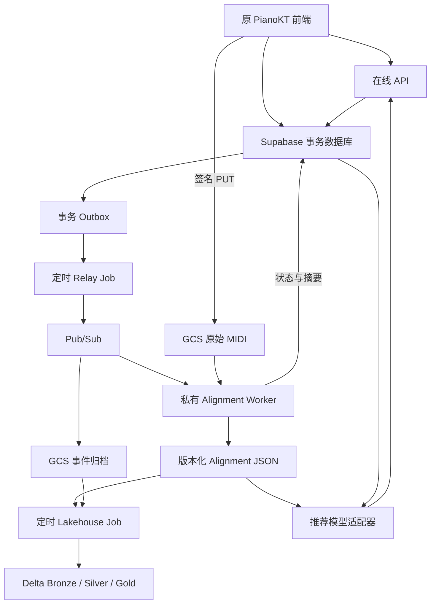
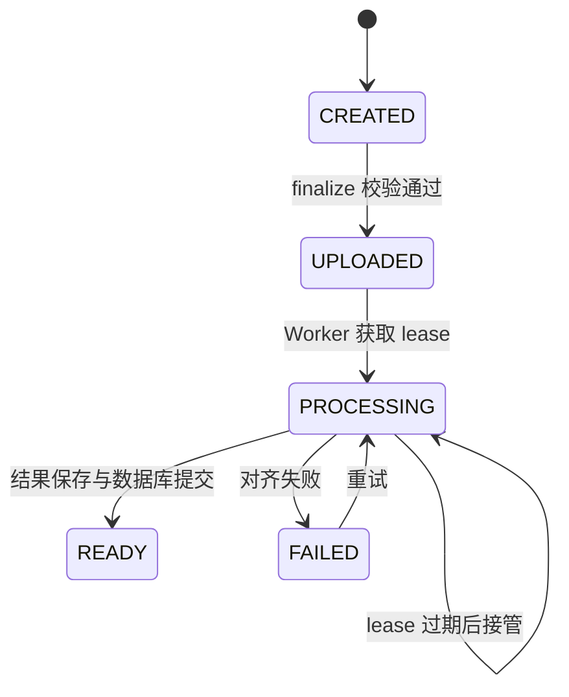

# PianoKT：从演奏到 alignment，再到推荐的代码级教程

本文件对应本次交付的代码。阅读顺序是：先认识系统的职责，再跟踪一份 MIDI，最后看失败恢复与模型接入。部署操作与下一步见 `DEPLOYMENT_AND_ROADMAP_ZH.md`，逐文件变化见 `CHANGES_ZH.md`，实际验证结果见 `VALIDATION_ZH.md`。

## 1. 这个工程现在是什么

原来的 PianoKT 是 React / TypeScript 前端，已经有播放器、MIDI 录制、Challenge 页面、Supabase 登录、练习事件和记录页面。这些目录与交互主体继续保留。新增的 Python 后端位于 `backend/`；云资源位于 `infra/gcp/`；新数据库迁移是 `supabase/migrations/009_lakehouse_backend.sql`。

本次交付实现的是一条可以本地验证、准备上云的工程链路：新录音直接上传 GCS，后端异步执行真实 Parangonar 对齐，保留原始文件与中间结果，生成 Delta 分层表，并向前端提供状态、对齐 JSON 和推荐接口。推荐器目前是显式的演示实现。没有声称已经训练 AKT、已经验证学习增益，或已经在你的 GCP 账户部署成功。

“实时数据库后端”和“分析型数据湖仓后端”是两个职责边界，不等于必须建立两个独立 Git 仓库。

| 职责 | 组件 | 本工程中的位置 |
|---|---|---|
| 页面、演奏与即时反馈 | 原 React 应用 | `src/` |
| 登录与按用户隔离的数据 | Supabase Auth / PostgreSQL / RLS | `supabase/` |
| 上传授权、在线结果、推荐请求 | FastAPI，Cloud Run Service | `backend/pianokt_backend/api.py` |
| MIDI 对齐计算 | 私有 Cloud Run Service，按请求启动 | `worker_api.py`、`worker.py`、`alignment/` |
| 数据库事件可靠发出 | Outbox relay，Cloud Run Job | `worker.py:relay` |
| 原始文件和归档事件 | GCS 私有 bucket | `storage.py`、Terraform |
| 分层分析表 | Delta Lake on GCS | `pipeline/` |
| 定时追平与重放 | Cloud Scheduler + Cloud Run Job | `cli.py`、Terraform |
| 推荐黑盒替换点 | `Recommender` 接口 | `inference.py` |

Supabase 在这里非常有价值：它承接小范围、低延迟、需要事务和用户权限的数据访问。Delta 湖仓承接可重放的历史数据、明细分析和训练数据准备。两者配合；没有把“用了 Spark”理解成所有请求都应该由 Spark 执行。

## 2. 先看整个数据流



图中有两个不同的“结果可用时刻”。Worker 完成时，用户已经能从在线 API 看到 alignment 摘要并下载完整结果。之后 Lakehouse Job 将该结果转换为分析表。用户看结果不必等下一轮 Spark 作业结束。

这避免了把推荐请求放在定时湖仓作业之后。但当前 relay 默认每天日本时间 02:00 运行，因此新上传最久可能等待约一天才开始 alignment；需要更低延迟时可手动执行 relay 或提高调度频率。这是异步、按需运行的后台处理，不是逐键毫秒级服务器反馈。演奏时原来的即时反馈仍在前端完成。

## 3. 跟着一份演奏走完整条上传链路

### 3.1 前端保存两份 MIDI

入口是 `src/pages/challenge/page.tsx` 的 `saveChallengeRecordingFromBytes`。

第一份是学生实际演奏的 `performance.mid`。第二份由 `referenceSnapshot.ts:referenceSnapshot` 创建，是这次练习的参考乐谱快照。快照应用了选定片段、左右手开关和移调，并保留手部 track 名称。这样，学生只练右手或只练中间一段时，后端不会拿无关的整首双手乐谱作为练习要求。

`@tonejs/midi` 在这里输出 MIDI 容器；设置 120 BPM 是将以秒表示的音符位置编码成 MIDI tick 的一种方式，不代表学生只能以 120 BPM 练习。当前前端录制使用 song-time 时间基准，练习设置会保存 `time_basis: song_time`。等待模式会改变时间含义，因此结果附有 `timing_labels_valid`，训练导出直接排除等待模式。

参考快照目前来自登录用户的客户端。SHA-256 可以证明后续处理的是同一份字节，不能证明该乐谱是平台认证的权威版本。用于正式考试、防作弊或严格曲目难度研究前，应增加服务端曲谱版本目录与参考快照校验；这项工作在路线图里明确列出。

### 3.2 创建 attempt，不上传到 Supabase Storage

`gcs.ts:saveGcsRecording` 计算两份文件的 SHA-256，并生成 `attempt_id`。同一标签页发生暂时上传失败时，sessionStorage 中的 attempt ID 会继续使用，避免每次重试都产生新任务。成功 finalize 后才清除这个缓存。

随后请求 `POST /attempts`。API 调用 Supabase Auth 检查 Bearer token，再调用原工程的 `check_user_allowed` RPC 执行白名单策略，从已认证身份获取 user ID。请求体中没有被信任的 `user_id` 参数。

API 建立 `piano_attempts` 行，生成对象路径：

```text
midi/<learner_key>/<attempt_id>/reference.mid
midi/<learner_key>/<attempt_id>/performance.mid
```

`learner_key` 是数据库中的伪名标识，映射表 `piano_learner_keys` 不向浏览器公开。伪名化仍允许平台内部关联学生，不等于不可逆匿名化。

API 返回两个十分钟有效的 GCS V4 signed URL。浏览器直接 PUT 到 GCS，MIDI 字节不经过 API 服务器，也不经过 Supabase Storage。签名绑定 `Content-Type: audio/midi` 和 `x-goog-if-generation-match: 0` 请求头。后者要求对象尚不存在，重试遇到 412 时交给 finalize 核实既有文件是否相同。[GCS XML API 条件请求头](https://docs.cloud.google.com/storage/docs/xml-api/reference-headers)

### 3.3 为什么上传完成后还需要 finalize

“浏览器说自己上传成功”不能直接当作后端事实。`POST /attempts/{id}/finalize` 会校验：对象存在、大小不超过 8 MB、指定 generation 的内容可读、SHA-256 相同、文件头是 MIDI。

完整 MIDI 解析和音符数量限制在 Worker 内完成。头部校验不能替代完整解析，所以格式损坏的文件仍可能在后续变为 FAILED；输入不会因此被删除。

核验通过后，数据库在同一个事务里执行：

1. `piano_attempts` 从 CREATED 改为 UPLOADED。
2. 写一条 `performance.uploaded` outbox。
3. 向原 `challenge_recordings` 表写入列表记录，路径为 `gcs:<attempt_id>`。

新记录仍能被原有列表和练习日志关联。原来的前端游戏分数保存在原 `accuracy_pct` 字段，后台 alignment 统计保存在 `piano_attempts.summary`。两者测量口径不同，不互相冒充。历史 Supabase 文件继续可下载，但新上传函数已经换成 GCS，没有过渡上传分支。

## 4. Outbox 解决的是哪个问题

假设你先提交数据库，再直接发 Pub/Sub。如果进程恰好在两步之间退出，就会出现“录音已保存，却永远没有对齐任务”。反过来，先发消息再写数据库，又可能让 Worker 读不到任务。

Outbox 将业务状态和“应该发什么事件”一起写入同一个 PostgreSQL 事务。`worker.py:relay` 随后读取尚未发布的 outbox 行，发布到 Pub/Sub，收到发布确认后填写 `published_at`。

读取使用 `FOR UPDATE SKIP LOCKED`，防止多个 relay 同时处理同一行。一次发布只持有一行事务。若 Pub/Sub 已收到消息，而数据库标记尚未提交就发生失败，下一次可能重发。因此这是 **至少一次投递 + 幂等消费**，不是跨 PostgreSQL、Pub/Sub、GCS 的分布式原子事务。

原来的 `play_events_raw` 也没有绕开这条可靠路径。迁移 009 为它增加 insert trigger：原练习事件与 outbox 在同一个事务产生。现有 `log_play_event` RPC 可以继续使用。归档 payload 采用字段白名单，不把任意用户 metadata 和可识别身份直接搬入事件湖。

## 5. alignment 原型怎样变成独立工程模块

### 5.1 算法来源与代码边界

`alignment/prototype.py` 提取自你上传的 `test_midi.ipynb` 第 3 个零基索引 cell，即第 4 个 cell 的函数和常量声明。没有执行 notebook 单元格，也没有保留 notebook 末尾依赖 `df/ref_midi/student_midi` 的调用。原型的分类、插入音归属和手部事件构造仍可直接阅读。

外围工程逻辑位于 `alignment/service.py`：输入校验、临时工作目录、固定 Parangonar 版本、输出契约检查、版本标识、时间校正、逐音符结果、摘要与阶段结果回调。

函数签名：

```python
align(reference: Path, performance: Path, attempt_id: str,
      config=AlignmentConfig(), stage_sink=None)
```

它返回普通 Python 字典，不自己连接 Supabase，不把云路径写死，也不要求调用方启动 Spark。`stage_sink` 在 matcher 产生原始配对后保存阶段结果，即使后续可靠时间锚点不足，也能留下 matcher 已产生的证据。

### 5.2 第一阶段：真实 MIDI 配对

调用固定版本 `parangonar==3.3.3` 的 `match_midis`，并使用 `shift_onsets_to_zero=False`。Parangonar 产生配对 CSV，主要关系是：

| alignment_type | 解释 |
|---|---|
| match | 一条参考音符与一条演奏音符被配对 |
| deletion | 参考音符没有找到对应演奏音符 |
| insertion | 演奏音符没有找到对应参考音符 |

match 只表示匹配关系，不自动等于弹对。还要检查音高和时间。原始配对保存在 `matching/<run_id>/matches.json`，成功完整结果同时包含 `raw_matches`。

### 5.3 第二阶段：整体时间偏移校正

某次录制可能整体晚开始 500 ms。若直接判每个音符的时间差，所有音符都会被误认为迟到。`correct_offset` 用同音高 match 作为候选锚点，按参考 onset 四舍五入到毫秒分组，对组内取中位数。

这样一个有十个音的和弦不会比一个单音时刻拥有十倍权重。接着计算各组演奏 onset 与参考 onset 的差，取中位数，并用 MAD 排除离群锚点。至少需要三个不同的可靠时刻。MAD 为零时仍使用 250 ms 的过滤下限，不回退到可能被大离群值放大的标准差。

校正公式为：

```text
aligned_performance_onset = original_performance_onset - global_offset
timing_deviation = aligned_performance_onset - reference_onset
```

这是整体平移，不是对学生速度曲线进行局部时间伸缩。演奏中逐渐加速、停顿、复奏、强烈 rubato，仍是需要真实标注集评估的边界。不要把当前误差阈值称为适用于所有学生、所有曲风的普遍标准。

### 5.4 第三阶段：note-level 与 hand-level 两种输出

note-level 保留每条 match/deletion/insertion 的关系、原始 onset、校正 onset、音高、是否正确和来源版本。

hand-level 构造 `events_data.data.left_hand/right_hand`，每只手有等长数组：

| 字段 | 含义与单位 |
|---|---|
| reject_reason | 错误原因编码 |
| timing_offset | 该事件时间偏移，毫秒 |
| pitch_offset | 音高偏移，半音 |
| duration | 时长，毫秒 |
| onset_time | 事件位置，毫秒 |
| pitches | 音高列表；无要求时可能为 `[-1]` |

编码保持原型约定：-1 无需演奏、0 正确、1 缺音、2 多音、3 错音或替换、4 过早、5 过晚、6 多类或其他错误。-1 不能在训练时简单变成错误标签，否则没有左手要求的右手练习会凭空产生大量“左手失败”。

手部以 reference track 名称为优先证据。单个音符 track 明确命名为 left 时保留左手；其他单轨情况按原型默认视为右手。多轨缺少明确名称时，使用原型的音轨/平均音高推断。多出来的演奏音没有天然参考手标签，所以使用邻近参考上下文推断。真实跨手、手交叉或音轨标注错误仍需评估。

回归测试发现 Parangonar/Partitura 会重编号音符 track，而原型使用 mido 原始轨号。新增 `alignment/tracks.py` 通过原始 tick、音高、channel、velocity 的对应关系，将 matcher 轨号恢复成原始轨号，再进入手部分类。保留 `ref_matcher_track` 便于审计。含 tempo-only track 的双手 fixture 已覆盖此问题；存在无法唯一映射的重复音轨时明确报错，避免静默猜错手。

前端录制也有一个针对 alignment 的修正：Challenge 每次收到 note-on/off 时先采样歌曲时钟，再写事件，不再仅依赖 100 ms UI 定时器推进时间；定时器仍负责静默段。保存时使用终止流程捕获的播放位置，避免播放器结束后重置为零，进而把整段数据错误标记成“未观察”。

原型会把邻近 deletion 与 insertion 组合解释为 substitution；这发生在 hand-level 产品中。底层 note-level 明细仍保留原来的缺音与多音，研究时可以重新定义标签，而不必重新寻找已经丢失的数据。

### 5.5 工程层解决了什么

配置使用不可变 `AlignmentConfig`。每次调用创建独立的原型模块命名空间，避免并发请求互相修改全局阈值。每次计算使用独立临时目录。run ID 由 attempt ID、两份 MIDI 的哈希、配置和 matcher 版本共同计算。改变算法配置会改变 run ID，便于保留多个版本。

Worker 对单次子进程设 480 秒超时，Cloud Run 请求上限配置为 540 秒，数据库 lease 为 10 分钟。超时会返回可重试错误；不能无限占用请求线程。超过 8 MB、空 MIDI、超过 10,000 音符或可靠锚点不足会明确失败，不输出看起来正常的假分数。

## 6. 状态、重试与“完成”



`worker.py:process` 先通过条件 UPDATE 获取 lease。READY 的重复消息直接返回。PROCESSING 的未过期任务拒绝重复执行；过期任务可以接管。

Worker 先写不可变结果，再写 attempt manifest，然后在数据库事务里写 READY、summary、result_key 和 alignment.completed outbox。如果在结果写入后、manifest 写入前退出，重试可根据确定的 run ID 找到已经保存的结果。若数据库提交失败，也可复用同一份结果补交，不必重新匹配。

Pub/Sub dead-letter subscription 用于检查持续失败的任务。毒性输入并不会因为反复重试就变好；管理员应依据 error_code 和原始 MIDI 检查，修复算法或输入后再处理。当前没有管理员重试 UI，操作见部署手册。

## 7. Raw、Bronze、Silver、Gold 实际都存什么

Raw 是对象存储中的来源层；Bronze/Silver/Gold 是 Delta 表的处理层。在这个工程里它们明确分开。

| 层级/路径 | 具体内容 | 为什么保留 |
|---|---|---|
| Raw `midi/` | 原始演奏 MIDI、这次练习的参考 MIDI | 重新对齐与追溯 |
| Raw `events/` | Pub/Sub 归档的 JSONL 消息 | 在作业停机时持续接收、日后重放 |
| 阶段归档 `matching/` | 未做教育标签解释的配对记录 | 时间校正失败时仍可排查配对 |
| 结果归档 `alignment/` | 完整版本化 result.json | 在线下载、重放入湖、模型读取 |
| Bronze `practice_events` | 原始消息文本 + 文本哈希 | 坏 JSON 也保留 |
| Bronze `alignment_runs` | 完整 alignment JSON envelope | 保留未压缩的结果契约 |
| Bronze `score_notes` / `performance_notes` | 成功对齐结果中提取的来源音符属性 | 音符层溯源 |
| Silver `practice_events` | 通过基础契约检查、按 event ID 去重的消息 | 后续业务解析入口 |
| Silver `midi_alignment_events` | 通过质量门禁的逐音符对齐明细 | 统一分析输入 |
| Gold `fact_midi_alignment` | 带学生伪名、歌曲和版本的音符事实 | 面向业务与研究查询 |
| Gold `hand_events` | 原型左右手事件的行式展开 | 构造时序模型样本 |
| Gold `fact_practice_attempt` | 每次对齐的数量和正确率摘要 | 曲目/学生/练习分析 |
| Quality | 坏消息或未通过门禁的 run | 隔离而非静默删除 |
| Ops `completed_runs` / `failures` | 发布完成标记与失败记录 | 恢复和完整性判断 |

`matching/` 和 `alignment/` 与 Raw 放在同一 bucket，但语义上是派生阶段归档，并非原始演奏本身。没有把所有东西都叫 raw。

Bronze 音符表当前由成功 alignment 的 raw_matches 提取。如果 MIDI 解析在 matcher 之前失败，它只有原始 MIDI；如果 matcher 成功但锚点校验失败，还会有 matching 阶段文件。不能声称每个失败文件都已经产生了完整 Bronze 音符表。

Silver 和 Gold 的逐音符表在这一版有较大重合，这是为了定义稳定的消费边界，并未用大量手工特征替代原始序列。额外 matcher 字段还保留在 `payload_json` 中；完整结果也始终可读取。

## 8. stream、micro-batch 与 checkpoint，在本工程中怎样对应

stream 表示输入在逻辑上持续增长。它不要求某个 Python 或 Spark 进程永远存活。学生事件先进入事务数据库和 Pub/Sub；GCS subscription 把消息批量写成对象。在 Spark 没有运行的时候，这些持久化服务继续接收数据。[Pub/Sub Cloud Storage subscriptions](https://docs.cloud.google.com/pubsub/docs/cloudstorage)

`pipeline/spark_events.py` 是真实 Structured Streaming 查询：

```python
spark.readStream.format('text').option('maxFilesPerTrigger',100).load(raw+'/events')
```

它先读 text 再 `from_json`，因此无法解析的行不会因为 schema 解析而悄悄消失。每次 micro-batch 在 `foreachBatch` 里先写 Bronze，再隔离坏记录，最后写 Silver。Delta MERGE 使同一个批次重跑时不会重复插入已存在 event ID。[Delta streaming 与 foreachBatch](https://docs.delta.io/delta-streaming/)

`trigger(availableNow=True)` 表示处理本次运行可用的数据，允许分成多个微批，然后终止。之后 Scheduler 再启动新的 Job，查询继续使用同一个 checkpoint。`maxFilesPerTrigger=100` 是每个微批的文件上限，不代表一次作业只处理 100 个文件。[Spark 4.0.1 Structured Streaming](https://spark.apache.org/docs/4.0.1/streaming/apis-on-dataframes-and-datasets.html)

这里没有常驻 Cloud Run Job。持续存在的是数据和消息服务，按需出现的是计算。你的 commerce-lakehouse GCP 版本也是这一类思路，构想没有冲突。

要区分三个名字很像但用途不同的东西：

| 名称 | 记录什么 | 不能替代什么 |
|---|---|---|
| Spark checkpoint | 文件源进度、批次提交等查询恢复信息 | 不能替代原始 MIDI/JSONL，也不是模型权重 |
| Delta `_delta_log` | 单张表的事务版本与数据文件集合 | 不会自动构成多张表的原子事务 |
| 模型 checkpoint | 权重、优化器等训练状态 | 不知道 Spark 读到了哪个输入文件 |

alignment 表处理不使用 Spark checkpoint。`pipeline/jobs.py:catch_up` 对不可变 result.json 与 `ops/completed_runs` 做差集，按 run ID 增量入湖。两种恢复方式分别对应事件流和完整演奏结果，文档不把它们混称为一个 checkpoint。

本版没有 watermark 去丢弃很迟才到的研究事件，也没有跨批次无限驻留的去重状态；去重主要由 Delta 主键 MERGE 完成。文件源仍有文件发现和保留语义，长时间停机、大规模回填应使用单独的输入前缀与新 checkpoint 验证，不能随意覆盖已经处理的 JSONL 文件。

## 9. 多表写入为什么要有 completed_runs

一次 alignment 会写 Bronze、Silver、Gold 等多张表。假设 Gold 已写到一半时 Job 退出，不能让分析者把半套结果当作完整发布。

所以 `publish_alignment` 最后才写 `ops/completed_runs`。消费者应只读取 completed run 对应的数据。例如在已经配置 Delta 的 SparkSession 中：

```python
complete = spark.read.format('delta').load(lake+'/ops/completed_runs')
facts = spark.read.format('delta').load(lake+'/gold/fact_midi_alignment')
published = facts.join(complete.selectExpr('event_id as alignment_run_id'),
                       'alignment_run_id', 'inner')
```

这不是数据库级多表原子提交，而是一种明确的发布协议。只要重试仍使用相同主键，已经完成的单表 MERGE 可以安全重复。`--replay` 重放已有结果文件到同一版本表；如果你改变了 schema 或业务语义，应写到新的湖仓根目录，验收后切换消费者，不能默认旧 completed 标记仍有效。

部署中的 pipeline Job 设置单任务、单并行度，并使用 PostgreSQL session advisory lock 防止多次调度重叠写入。独立本地命令没有 DATABASE_URL 时，不具备跨进程锁；不要同时向同一目录启动两个本地 pipeline。数据库必须使用直连或 session pooler，不能使用破坏会话锁语义的 transaction pooler。

## 10. 模型接口已经接在哪里

`POST /recommendations` 从已登录学生的 READY attempts 读取最近三次结果，按时间排列，将完整 notes、events_data、practice_metadata 与 summary 交给 `inference.py` 的适配器。还会读取学生音乐偏好和启用的歌曲目录。

```python
recommend(history, preferences, candidates, top_k)
```

响应携带 `model_version`、`input_alignment_run_ids` 与推荐 ID，后续曝光/点击带上推荐 ID，写入反馈表和 outbox。前端录音页可以请求推荐并进入内置曲目。

当前 `DemoRecommender` 只用简单透明的难度/偏好启发式做接口演示。版本名含 `NOT-TRAINED`，预测正确率与学习增益返回 null，界面也显示 demo。替换真实模型时，还要把 API 的 `is_demo` 与模型输出契约一起改掉；不应该仅替换一行类名就对用户宣称已验证能力估计。

本版不生成新的 MIDI 作曲内容，只推荐已配置曲目；“生成一首练习曲”是未来另一个受约束生成模块。当前也没有持续维护的学习者神经网络隐状态；用最近三次完整结果读取代替，便于先打通输入输出。大规模服务时再增加版本化状态缓存。

## 11. note-level 预测怎样走向整曲推荐

能力匹配的推荐目标是：给定学生历史和候选曲目，选择适当挑战程度、偏好合适的练习。它与预测一个已发生音符是否正确不是同一个评价目标。

不要先把学生所有历史压成一个总正确率，再把整首歌压成一个总难度，就期待模型恢复所有节奏、和弦、手部转换的信息。这个工程保留了细粒度序列，让未来可以比较以下方案：

1. 简单可解释基线：最近表现 + 人工标注曲目难度 + 偏好。
2. KT 编码历史，歌曲编码器处理候选谱面，联合输出适配分数。
3. 对候选歌曲的多个位置预测表现分布，再结合覆盖率、风险和偏好排序。

AKT 的训练窗口 `seq_len` 不等于整首歌最多只能推荐这么多音符。窗口限定的是一次模型调用处理的历史范围，长历史可以分窗、截取最近窗口，或使用另行设计的记忆机制。真正需要避免的是训练/评估泄漏：预测未来歌曲时，不能把这首歌尚未发生的真实学生响应当作已知输入。对后续时间步进行推演时，要明确使用未知响应、模型自身预测，还是只对已观察前缀评分。

“端到端”主要指学习目标与参数训练方式，不要求删除数据契约、版本和质量控制。是否应该使用 hand-level 聚合，应该用保留的 note-level 数据做消融比较。更多中间特征不必然更差，但不可逆压缩可能丢失信息；保留原始明细让这个问题可以被实验回答。

## 12. 收集数据、更新状态、重训模型是三件事

用户事件可以持续收集；每次演奏完成后可以更新在线结果；模型权重不需要随着每个事件更新。当前实际实现了前两者的数据通道与模型接入口，没有自动训练作业。

`pipeline/training.py:export_dataset` 提供可重现训练快照：只选择已发布 run、尝试创建时间和 alignment 完成时间都早于 cutoff 的结果；排除 waiting mode；排除 -1；排除未观察到的曲段尾部；保留 learner、attempt、run 的关联与数据集版本。一个 attempt 存在多个 alignment 版本时会拒绝静默混合。

导出后还必须按学生/时间拆分训练验证测试集，再分窗口，并拟合只属于训练集的词表与归一化参数。数据集导出成功不等于已经做完这些评估工作。更严格的历史快照还应固定 Delta 版本和当时已知的服务端数据可用时间；当前输出固定已选记录与哈希，但没有自动创建历史特征库。

什么时候重训应由新数据量、漂移、离线验证和产品实验决定，不能用“每十五分钟有一次 pipeline”推导出“每十五分钟重训模型”。先建立可靠基线和足够样本，再决定更新频率。

## 13. 建议按这个顺序读代码

| 顺序 | 文件 | 阅读时要回答的问题 |
|---|---|---|
| 1 | `src/pages/challenge/page.tsx` | 保存录音的入口在哪里？保存时知道哪些练习设置？ |
| 2 | `src/features/challenge-history/gcs.ts` | 为什么要先创建任务，再 PUT，最后 finalize？ |
| 3 | `backend/pianokt_backend/api.py` | 用户身份从哪来？哪些操作属于同一事务？ |
| 4 | `supabase/migrations/009_lakehouse_backend.sql` | 哪些表是在线状态？哪些字段是数据关联键？ |
| 5 | `worker.py`、`worker_api.py` | 为什么有 lease、manifest 和超时？ |
| 6 | `alignment/service.py` | 配对、时间校正与标签怎么分开？ |
| 7 | `alignment/prototype.py` | 左右手和 substitution 具体怎么构造？ |
| 8 | `pipeline/jobs.py`、`tables.py` | 表的粒度是什么？为什么最后发布 completed？ |
| 9 | `pipeline/spark_events.py` | 有限生命周期的 Job 怎么持续处理增长的数据？ |
| 10 | `pipeline/training.py`、`inference.py` | 数据集与在线推理怎样使用同源记录？ |
| 11 | `infra/gcp/main.tf` | 每个服务账号实际需要哪些云权限？ |

掌握这条主线后，再对照测试中的故障场景，比逐行从 Dockerfile 开始背语法更容易理解整个项目。
